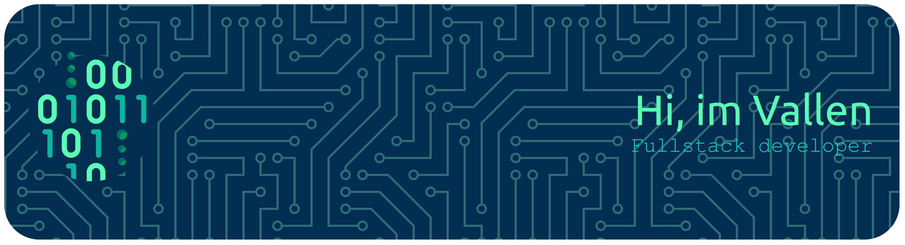

# 💫 About Me:
🎓 I am an active student at Satya Wacana Christian University

## 🌐 Socials:
 

# 💻 Tech Stack:
      
# 📊 GitHub Stats:
 
 

### ✍️ Random Dev Quote

---

<!-- Proudly created with GPRM ( https://gprm.itsvg.in ) -->
